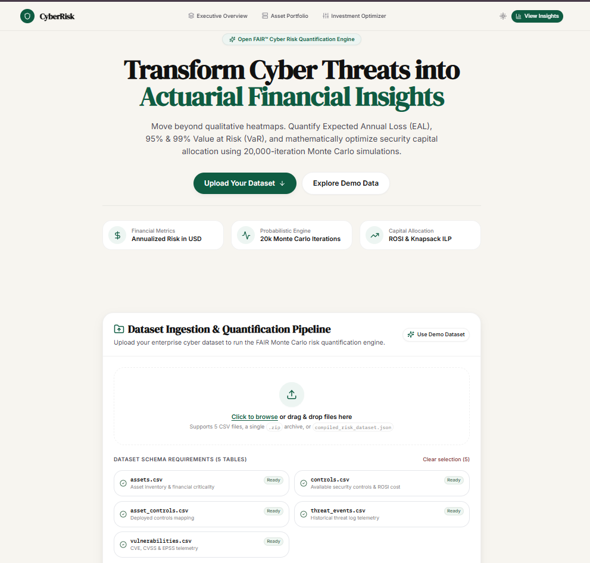
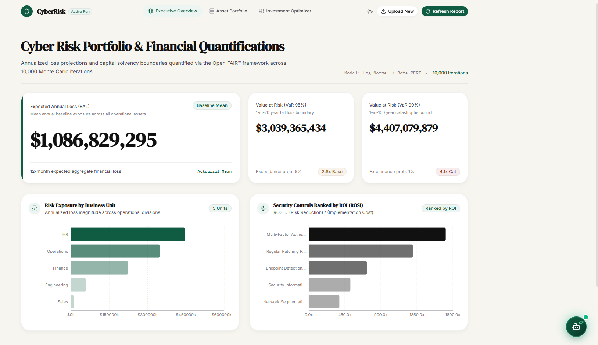
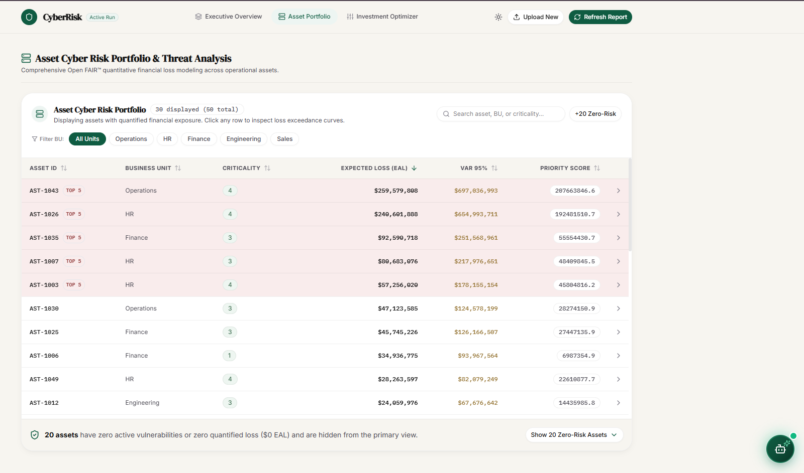
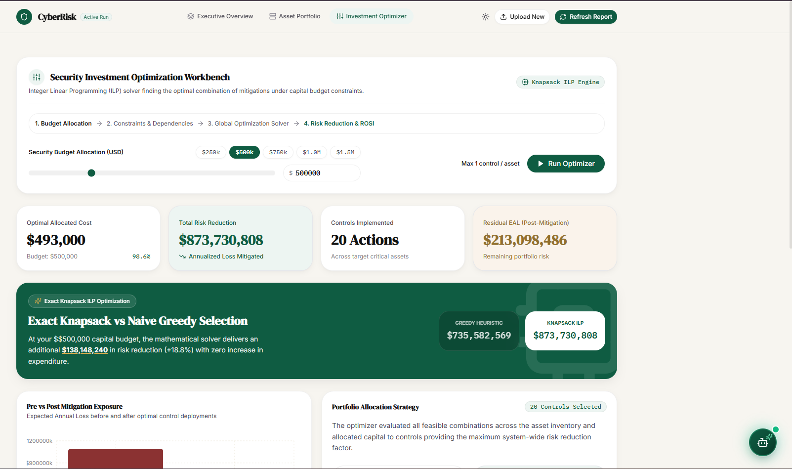
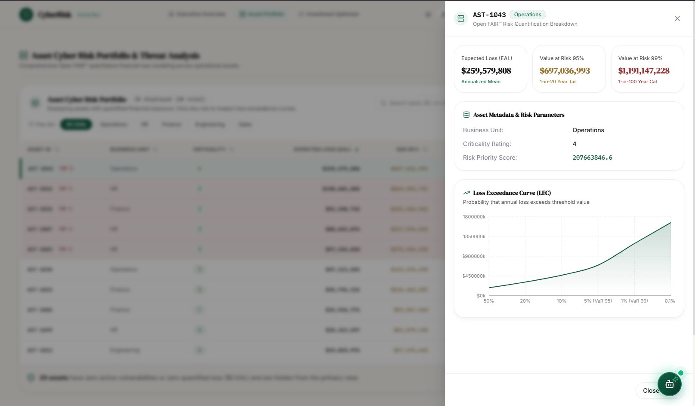
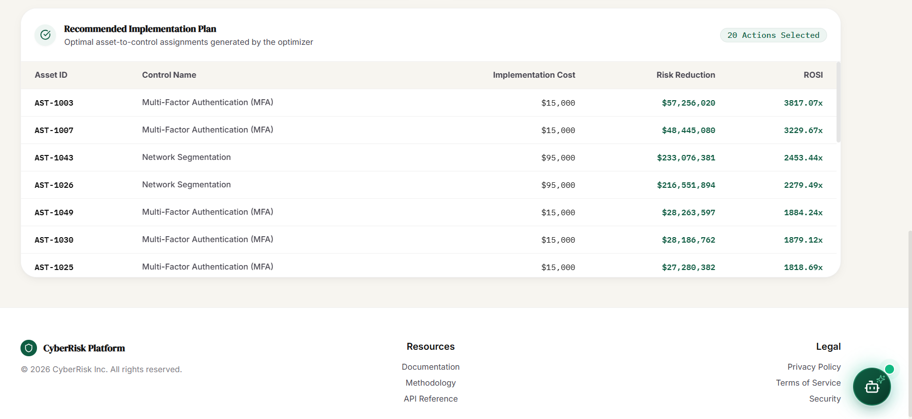
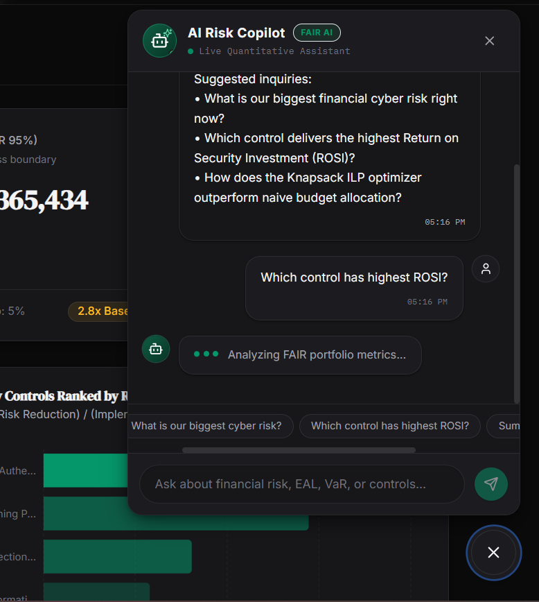

# CyberRisk – FAIR-Based Cyber Risk Quantification & Investment Optimization Platform

This repository contains the complete implementation for our **Smart India Hackathon (SIH 2026)** project: an enterprise-grade quantitative cyber risk assessment and security budget optimization platform.

---

## 1. Project Information

- **Project Title:** CyberRisk – FAIR-Based Cyber Risk Quantification & Investment Optimization Platform
- **PS ID:** 26105
- **PS Title:** AI-Powered Continuous Cyber Risk Quantification and Investment Optimization Platform
- **Category:** Software
- **Theme:** Blockchain & Cybersecurity
- **Organization:** All India Council for Technical Education (AICTE) — Cyber Security Cell

---

## 2. Problem Statement

Enterprises invest heavily in cybersecurity tools and compliance programs, yet cyber risk is still communicated using vague qualitative ratings such as "Low," "Medium," or "High." These labels fail to express actual financial exposure, making it difficult for senior management, boards, and regulators to judge whether current security spend is adequate or optimally allocated. Because most risk assessments are periodic and manual, organizations also lack real-time visibility into their evolving cyber exposure — leading to misprioritized remediation and under- or over-spending on security controls.

---

## 3. Proposed Solution

**CyberRisk** bridges the gap between technical vulnerability telemetry and boardroom financial decisions using the **Open FAIR™ (Factor Analysis of Information Risk)** methodology combined with **Monte Carlo simulation**.

Users can upload their own enterprise cyber telemetry (5 CSV files, a ZIP bundle, or a compiled JSON dataset) — or use the built-in demo dataset — to run a full FAIR-based Monte Carlo risk quantification pipeline. The platform computes Expected Annual Loss (EAL) and Value at Risk (VaR95/VaR99) at the asset, business-unit, and organization level, evaluates the Return on Security Investment (ROSI) of candidate security controls, and mathematically determines the optimal security investment plan under a specified budget using Integer Linear Programming (ILP). All of this is presented through an interactive dashboard, with an embedded AI assistant for natural-language questions about the organization's risk posture.

---

## 4. Key Features

- **Interactive Dataset Ingestion & Validation:** Drag-and-drop upload of a 5-CSV bundle, a ZIP archive, or a compiled `compiled_risk_dataset.json` file, with schema validation against the required tables (`assets.csv`, `vulnerabilities.csv`, `threat_events.csv`, `controls.csv`, `asset_controls.csv`). A one-click "Use Demo Dataset" option is available for evaluation without needing your own data.
- **Actuarial Monte Carlo Simulation:** 20,000 iterations per asset using EPSS exploit probabilities, CVSS severity scores, and empirical threat event frequencies derived from historical telemetry.
- **Financial Risk Metrics:** Computes Expected Annual Loss (EAL), 95%/99% Value at Risk (VaR), and Loss Exceedance Curves (LEC) — at asset, business-unit, and organization level.
- **ROSI Benchmark Analytics:** Dollar-for-dollar Return on Security Investment for both currently deployed and candidate controls (EDR, MFA, Network Segmentation, Patching, SIEM), computed via full before/after re-simulation, not a flat formula.
- **Knapsack ILP Investment Optimizer:** Solves an exact budget-constrained 0/1 knapsack optimization to identify the mathematically optimal set of security investments, benchmarked against a naive greedy (sort-by-ROSI) baseline.
- **AI Risk Copilot:** An embedded conversational assistant with live access to the organization's quantified risk metrics, able to answer natural-language questions like "What's our biggest risk right now?"
- **Responsive Dashboard:** Executive and technical views with drill-down asset inspection, business-unit risk charts, and a live "what-if budget" optimizer panel.

---

## 5. Technology Stack

- **Frontend:** React 18, Vite, TailwindCSS, Recharts, Lucide Icons, Axios, React Router DOM
- **Backend:** Python 3.10+, FastAPI, Uvicorn, Pydantic, python-multipart (file upload handling)
- **Quantitative Engine & Mathematics:** NumPy, SciPy, Pandas, PyArrow (Parquet), PuLP (COIN-OR CBC ILP Solver)
- **AI / LLM:** Google Gemini API, called from the backend (never exposed to the browser) with the live computed risk data supplied as context for each query
- **Database:** See note below
- **Testing & Quality Assurance:** Pytest

### A Note on the Database

For the hackathon prototype, uploaded datasets and session state are currently held in the frontend's local/session storage for simplicity, and computed risk outputs are written to Parquet files on the backend. This works for a single-user demo but is not durable or multi-user-safe.

**Recommended production setup:** **PostgreSQL** as the primary database for asset, vulnerability, control, and user/session data — a relational database fits well here because assets, vulnerabilities, and controls have genuine foreign-key relationships, and ACID guarantees matter for an auditable, compliance-oriented tool (RBI CSF / SEBI CSCRF reporting requires trustworthy record-keeping). Alongside it, an **object storage layer** (e.g. S3-compatible storage, or local disk for a self-hosted deployment) should hold raw uploaded dataset files and the computed Parquet risk outputs, since those are large, columnar, and better suited to file-based analytical storage than to being stuffed into relational rows. This hybrid (PostgreSQL for relational/transactional data + object storage for bulk files) is the standard pattern for this kind of analytical platform, and is listed under Future Scope below.

---

## 6. Architecture

```
User / Browser
      │
      ▼
React Dashboard & Dataset Upload Portal (Vite + Tailwind + Recharts)
      │
      ▼ (REST API / CORS)
FastAPI Backend (api/main.py)
      ├── /api/datasets/upload   (dataset ingestion & schema validation)
      ├── /risk/*                (asset, business-unit, org risk summaries + loss curves)
      ├── /controls/*            (ROSI rankings & Knapsack ILP optimizer)
      └── /chat                  (AI Risk Copilot assistant)
      │
      ▼
FAIR-Based Risk Quantification Pipeline (risk_engine/)
  ├── Ingestion & Normalization
  ├── Likelihood (EPSS/CVSS-based)
  ├── Threat Event Frequency
  ├── Loss Magnitude (lognormal)
  ├── 20k-iteration Monte Carlo Simulation
  ├── Control Scenarios & ROSI
  └── Knapsack ILP Investment Optimizer
      │
      ▼
Computed Risk Outputs (Parquet) → returned to Frontend Dashboard & AI Copilot
```

See [docs/architecture.md](docs/architecture.md) for the detailed component breakdown.

---

## 7. Repository Structure

```
SIH2026/
├── README.md                          # Project overview and instructions
├── src/backend/                           # Python FastAPI backend & risk engine
│   ├── api/
│   │   ├── main.py                    # FastAPI root & route definitions
│   │   ├── upload.py                  # Dataset upload & schema validation endpoints
│   │   └── chat.py                    # AI Copilot assistant endpoint
│   ├── risk_engine/                   # Open FAIR quantitative pipeline
│   │   ├── config.py                  # Actuarial constants & benchmarks
│   │   ├── ingest.py                  # Raw CSV validation & normalization
│   │   ├── likelihood.py              # Vulnerability & EPSS modeling
│   │   ├── frequency.py               # Threat event frequency modeling
│   │   ├── loss_magnitude.py          # Lognormal financial loss calibration
│   │   ├── simulate.py                # Monte Carlo simulation engine
│   │   ├── aggregate.py               # EAL, VaR95, VaR99 calculation
│   │   ├── control_scenarios.py       # Before/after control ROSI evaluation
│   │   ├── investment_optimizer.py    # Knapsack ILP optimization solver
│   │   └── pipeline.py                # End-to-end pipeline orchestrator
│   ├── data/                          # Sample/demo input datasets (5 CSVs)
│   ├── outputs/                       # Computed risk Parquet datasets (gitignored)
│   ├── tests/                         # Pytest test suite
│   └── requirements.txt               # Backend Python dependencies
├── src/frontend/                          # React + Vite frontend application
│   ├── src/
│   │   ├── api/client.js              # Axios API client & formatters
│   │   ├── context/DatasetContext.jsx # Session dataset state management
│   │   ├── hooks/useApi.js            # Custom async data-fetching hook
│   │   ├── components/
│   │   │   ├── home/                  # Hero, About, UploadDropzone, ProcessingOverlay
│   │   │   ├── dashboard/             # ExecutiveSummary, BUChart, AssetTable, Optimizer
│   │   │   ├── chatbot/               # ChatWidget, ChatWindow, ChatMessage
│   │   │   ├── layout/                # Header navigation & theme toggle
│   │   │   └── ui/                    # Button, Card, Badge design primitives
│   │   ├── pages/                     # HomePage & DashboardPage
│   │   ├── App.jsx                    # Client-side router configuration
│   │   └── main.jsx                   # React DOM entrypoint
│   └── package.json                   # Frontend dependencies
├── docs/
│   └── architecture.md                # Detailed system architecture
├── submission/                        # Presentation and demo links
│   ├── PRESENTATION.md
│   └── DEMO.md
├── assets/                            # Screenshots and media assets
│   └── screenshots/
├── .gitignore
└── LICENSE
```

### What Goes Where?

| Item | Location |
|---|---|
| Backend source code (risk engine, API) | `src/backend/` |
| Frontend source code (dashboard, upload portal, chatbot) | `src/frontend/` |
| Technical documentation & architecture | `docs/architecture.md` |
| Project screenshots | `assets/screenshots/` |
| Final PPT / presentation | `submission/PRESENTATION.md` |
| Demo video link | `submission/DEMO.md` |
| Project overview | `README.md` |

---

## 8. Final Presentation

Keep your final SIH presentation in the repository:
- Details and presentation slides link: [submission/PRESENTATION.md](submission/PRESENTATION.md)

---

## 9. Demo Video

- Live product demo video walkthrough: [submission/DEMO.md](submission/DEMO.md)

---

## 10. Screenshots / Prototype Photos

Visual demonstration screenshots and UI walkthroughs are located in:
- [assets/screenshots/](assets/screenshots/)

### Home — Dataset Upload & Overview

Landing page with the drag-and-drop dataset ingestion pipeline, live schema validation for all 5 required tables, and a one-click demo dataset option.

### Executive Overview Dashboard

Organization-wide Expected Annual Loss, Value at Risk (95%/99%), risk exposure by business unit, and security controls ranked by ROSI — computed via 10,000-iteration Monte Carlo simulation.

### Asset Portfolio

Sortable, searchable asset-level risk table with EAL, VaR95, and priority scoring across all business units.

### Investment Optimizer

Budget-constrained Integer Linear Programming (Knapsack ILP) optimizer, benchmarked live against a naive greedy baseline — demonstrating measurably better risk reduction from exact optimization.

### Asset Risk Detail — Loss Exceedance Curve

Per-asset drill-down showing the full Loss Exceedance Curve derived from the Monte Carlo simulation.

### Recommended Implementation Plan

The optimizer's concrete asset-to-control action plan, with implementation cost, risk reduction, and ROSI per action.

### AI Risk Copilot

Conversational assistant with live access to the organization's quantified risk metrics, answering natural-language questions about financial cyber risk.

---

## 11. Installation

### Prerequisites
- Python 3.10+
- Node.js 18+ and npm

### 1. Clone the Repository
```bash
git clone https://github.com/kshitij3103/SIH2026.git
cd SIH2026
cd src
```

### 2. Backend Setup
```bash
cd backend
python -m venv venv

# Windows:
.\venv\Scripts\Activate.ps1
# Linux/macOS:
# source venv/bin/activate

pip install -r requirements.txt
copy .env.example .env        # then fill in HUGGINGFACE_API_KEY
```

### 3. Frontend Setup
```bash
cd ../frontend
copy .env.example .env      # then fill in VITE_API_BASE_URL
npm install
```

---

## 12. Run

### 1. Start the Backend API Server
```bash
cd backend
# with virtual environment active:
uvicorn api.main:app --reload --port 8000
```
API documentation will be available at `http://localhost:8000/docs`.

### 2. Start the Frontend Development Server
```bash
cd frontend
npm run dev
```
Open `http://localhost:5173` in your browser.

### 3. Run Backend Unit Tests
```bash
cd backend
pytest -v
```

---

## 13. Future Scope

- **Persistent, Multi-User Data Layer:** Migrate from the current local/session storage prototype to PostgreSQL (relational asset/vulnerability/control data) plus object storage (raw uploads and Parquet outputs), as detailed under Technology Stack above.
- **Real-Time SIEM & EDR Webhook Ingestion:** Direct streaming connectors for tools like Splunk, Microsoft Sentinel, and CrowdStrike Falcon for continuous automated EAL recalculation instead of manual dataset upload.
- **Compliance Framework Mapping:** Built-in mapping of findings and controls to ISO/IEC 27001, NIST CSF, CIS Controls, RBI Cyber Security Framework, and SEBI CSCRF, with auto-generated audit-ready reports.
- **Modeling Correlated/Systemic Risk:** Move beyond the current independence assumption for EAL/VaR aggregation to account for events (e.g. ransomware) that can affect multiple assets simultaneously.
- **Multi-Tenant Enterprise RBAC:** Role-based access control with granular organizational permissions for large enterprise fleets.
- **Cloud Infrastructure Auto-Discovery:** Automated asset synchronization with AWS, Azure, and GCP asset inventories.

---

> **Important:** Before submission, ensure no passwords, confidential tokens, or secrets are committed. Use `.env.example` templates for configuration, and confirm `.env` files are listed in `.gitignore`.